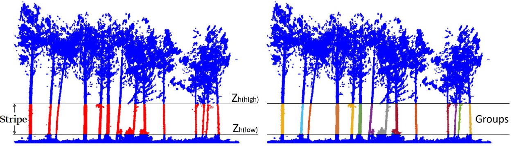
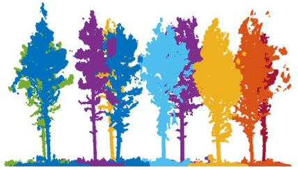
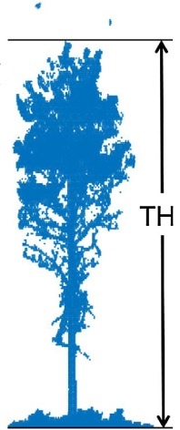

Algorithm
=========

The package functionalities are based on an updated version of the algorithm presented in [CABO2018]_. What follows is a description of the main steps of the algorithm.

0. Height-normalization of the point cloud
----------------------------------------------------------------

The algorithm starts with a height-normalized point cloud as input, as in Figure 1. Functionality to compute normalized heights is provided in ground module.

*Figure 1. The algorithm uses normalized heights, which can be computed using dendromatics functionalities. A) Original point cloud. B) Height-normalized point cloud. From* [CABO2018]_.

To achieve this, a digital terrain model (DTM) is generated and the normalized heights for each point in the cloud are obtained as the difference between their (z) value and the (z) value of the DTM points that are below. 

To generate the DTM itself, a cloth-simulation filter (CSF) as described in [ZHAN2016]_ is applied to the point cloud. To obtain the DTM points that are below a certain cloud point, a KDtree is generated and the 3 closest DTM points are identified. Then, a weighted average of the (z) value based on the distance to the cloud point is obtained, and the normalized height value is computed as the difference between the (z) value of the cloud point and the weighted average (z) value of the DTM points.

1. Identification of stems among user-provided horizontal stripe
----------------------------------------------------------------

In this first step, the user selects a stripe, defined this as a subset of the original cloud delimited by a lower height (:math:`Z_{h(low)}`) and an upper height (:math:`Z_{h(high)}`), which will narrow down a region where it is expected to only encounter stems. The points within the stripe will be voxelated and their verticality will be computed, based on fixed radius neighbourhoods. Then, they will be filtered based on their verticality value. After this, the remaining points will be clustered using the DBSCAN algorithm ([ESTE1996]_). These procedures will be repeated iteratively a user-defined number of times. At this stage, the potential stems are referred as ‘voxel groups’. Figure 2 illustrates this step of the algorithm.

*Figure 2. Stripe on the height-normalized point cloud, and candidate voxel groups. Points in the stripe in red, and voxel groups in random colours. From* [CABO2018]_.

2. Tree individualization based on point-to-stems distances
-----------------------------------------------------------

Once the voxel groups have been computed and properly peeled-off, they are isolated and enumerated, and then, their axes are identified using PCA (PCA1 direction). These axes will be henceforth considered as stem axes. This allows to group points based on their distance to those axes, thus assigning each point to a tree. This is illustrated in Figure 3. 

*Figure 3. Isolated trees. Note that ground and understory points are assigned as well to the closest axis. From* [CABO2018]_.

During this step of the algorithm the tree height is computed as well. For this, and, for each tree, the points that are under a certain distance to the stem axis are selected, voxelated again using a higher resolution and clustered with DBSCAN algorithm. From the points that belong to the main cluster (the one that englobes the tree), the highest point is selected, and its height is considered as the tree height. This allows to exclude from the search of the highest point those that could belong to other trees or any noise that happened to be above the tree whilst being scanned. Figure 4 illustrates this.

*Figure 4. Total tree height (TH) computation. Note that it avoids isolated point clusters that may not belong to the tree. From* [CABO2018]_.

3. Computation of stem diameter at different section heights
------------------------------------------------------------

In this final step a set of heights is defined, which will then be used to measure the stem diameter at different sections around the tree axes. To do so, a slice of points will be selected at every section, and those will be fit a circle by least squares minimization. This procedure is similar as the one proposed in [PREN2021]_.

To ensure robustness, the goodness of fit is checked. What follows is a brief list of all the **tests** that are performed:

* Number of points inside the circle. This is checked via fitting an **inner circle**
* Percentage of **occupied sectors**
* Size of fitted circle (if it is **radius is too small/big**)
* **Vertical deviation from tree axis** ('outlier probability’)

First, a complementary, inner circle is fitted as well, which will be used to check how points are distributed inside the first circle: they are expected to be outside the inner circle, as the scanning should only scan the surface of the stems. Second, the section is divided in several sectors to check if there are points within them (so they are occupied). If there are not enough occupied sectors, the section fails the test, as it is safe to assume it has an abnormal, non-desirable structure. After this, it is checked whether the diameter of the fitted circle is within some boundaries, to discard anomalies. Finally, the vertical deviation from the tree axis is computed for every section and it is used to check possible bad fittings: highly deviated sections are labelled as possible outliers. 

On top of all goodness of fit tests, there is a last layer or robustness while computing the diameters. If the first fit is not appropriate, another circle will be fitted to substitute it using only points from the largest cluster in the slice of points, and the goodness of fit will be tested again. Figure 5 illustrates an example of some fitted circles after all tests and their respective axes.

*Figure 5. Fitted circles in 6 stems, at sections ranging from 0.3 to a maximum of 25.0 meters, one every 0.2 meters. Blue circles passed all quality tests, while red circles mean the fitting may be unreliable. This may be due to partial scans, non-expected diameter measurements, non-reasonable distribution of points within the section or a high value of tilting. Computed axes are represented at the right.*

During this step, besides computing all the diameters at the selected heights, the DBH will be approximated as well (even if BH was not included as one of the selected heights). For this, the section closest to 1.3 m will be used as a proxy, and the DBH will only be computed if there is coherence between that section and the ones around. 

Tree location \[(x, y) coordinates\] is obtained at this step too, either derived from the proxy section (to BH) when appropriate; that is, when it passes all goodness of fit tests and it is coherent, or from the tree axis when not.
