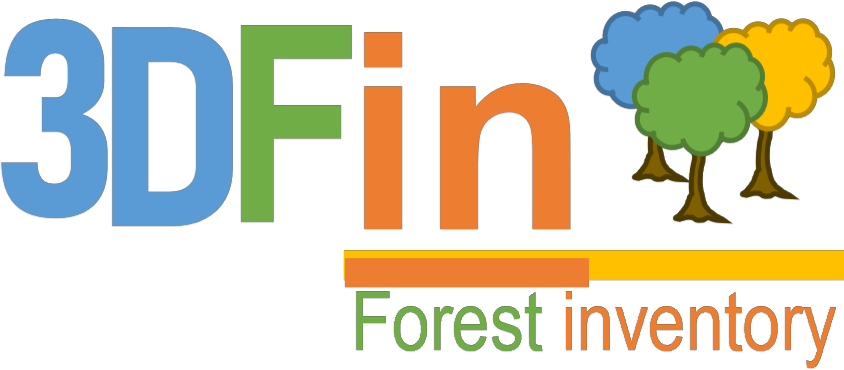

3DFIN
=====

The functionalities of dendromatics are intended to be used 'one after another' in an algorithmic fashion; as so, they do not make much sense outside a script that runs all of them. For this reason, they have been implemented in a standalone, desktop program for ease of use. It is designed as a one-click tool that runs the complete algorithm to process terrestrial point clouds from forest plots.

If you prefer that format or, simply, if you are a non-programmer and you would wish to use an implementation of the algorithm, you might enjoy **3DFIN: 3D Forest Inventory**. It is available under its GitHub repository:

https://github.com/3DFIN
